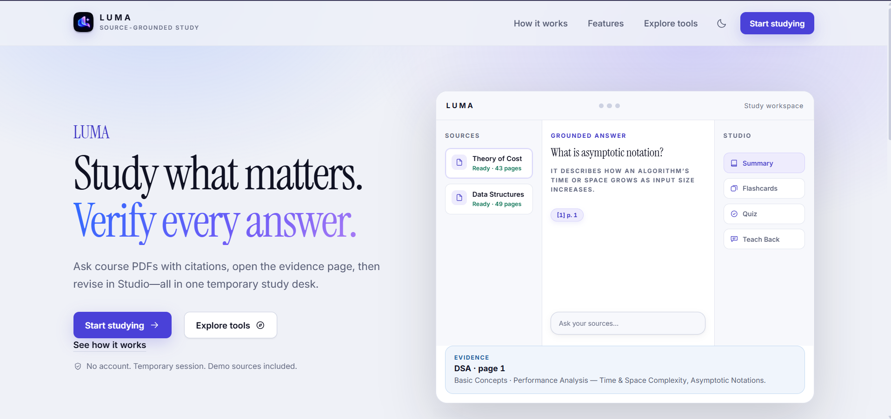
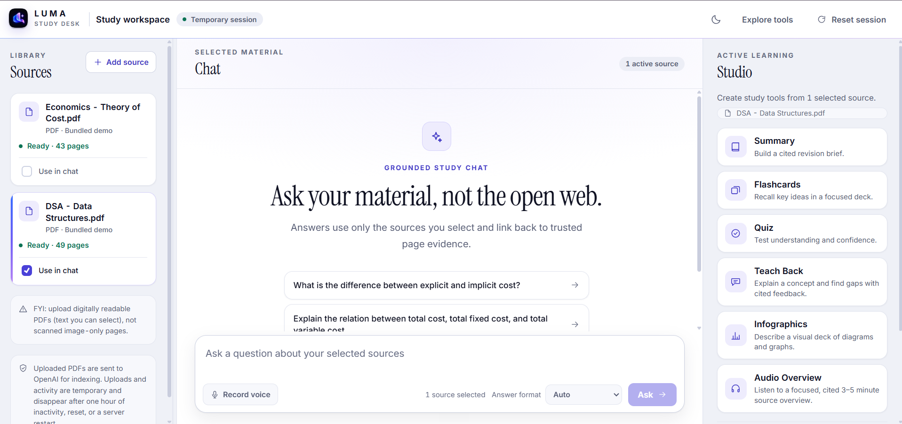
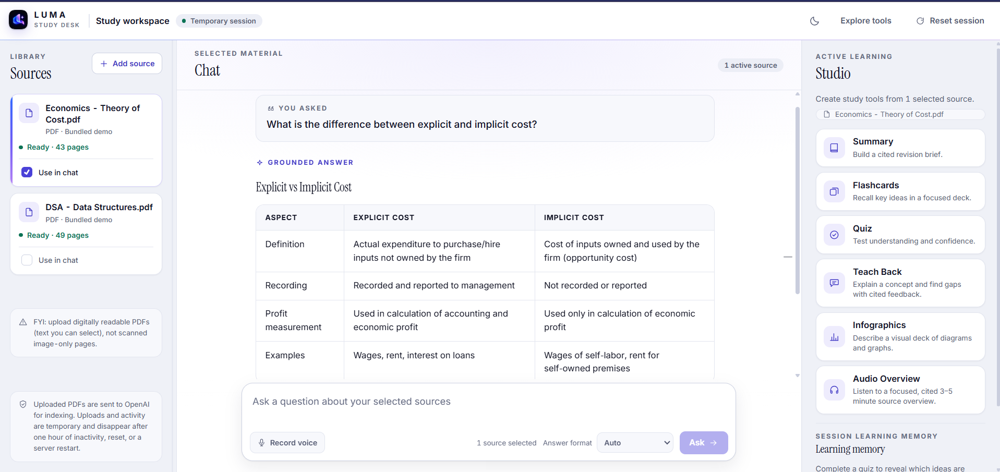
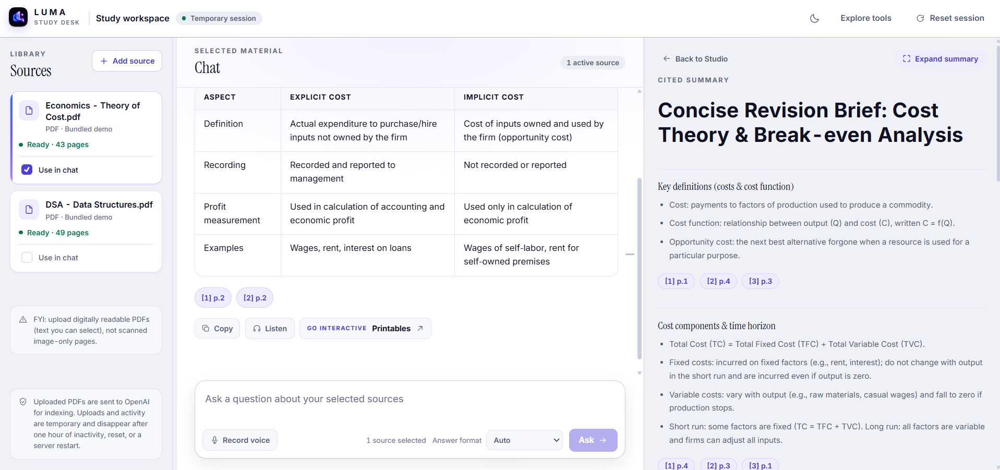
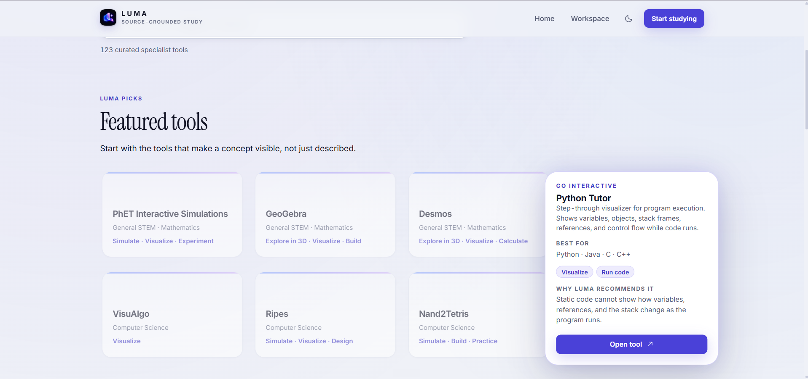

<p align="center">
  
</p>

# <p align="center">LUMA</p>

<h2 align="center">Source-grounded study desk for course PDFs</h2>

<hr>

<p align="center">
  Ask your material with page citations, revise in Studio, and keep evidence one click away.
</p>

<p align="center">
  <a href="https://luma-study.onrender.com"><b>Live demo</b></a>
  &nbsp;|&nbsp;
  <a href="./docs/PRODUCT_REQUIREMENTS.md"><b>Product docs</b></a>
  &nbsp;|&nbsp;
  <a href="./docs/ARCHITECTURE.md"><b>Architecture</b></a>
</p>

## Complete description

### Product

**LUMA** is a citation-grounded revision tool for college students. It turns course PDFs into a Sources-Chat-Studio workspace where answers stay tied to selected material, and study tools help surface weak understanding before an exam.

It is not a general chatbot and not a full adaptive-learning platform. The core promise:

> Every factual answer should be traceable to the student's own material, and every study activity should help reveal what the student has not mastered.

### Problem

Students often have large, fragmented notes and little time to revise them. Ordinary summarizers compress content without checking learning. Generic chatbots can answer from outside knowledge, hide uncertainty, and give no fast path back to the source page.

LUMA focuses on three frictions:

1. Finding an answer across course PDFs.
2. Verifying that answer against the exact source page.
3. Discovering weak understanding before an exam.

### Aim

1. Keep every factual chat answer grounded in selected sources.
2. Make page evidence one click away from any citation.
3. Turn the same sources into summary, flashcards, quiz, teach-back, and optional voice study tools.
4. Ship a reliable temporary demo without accounts, databases, or durable uploads.

### Summary

The desktop workspace opens with pre-indexed demo sources (Economics and DSA), accepts temporary PDF uploads, answers with backend-validated page citations, and opens the cited PDF in an evidence sheet. Studio generates revision tools from the same selected sources. English-India speech is optional through Sarvam STT/TTS, with text fallback if speech fails.

## Screenshots

<p align="center">
  
</p>
<p align="center"><b>Landing</b></p>

<p align="center">
  
</p>
<p align="center"><b>Workspace</b></p>

<p align="center">
  
</p>
<p align="center"><b>Cited chat</b></p>

<p align="center">
  
</p>
<p align="center"><b>Cited summary</b></p>

<p align="center">
  
</p>
<p align="center"><b>Explore tools</b></p>

## Features implemented

1. Concise landing page with Start studying into `/workspace`.
2. Sources-Chat-Studio desktop workspace with responsive sheet layout.
3. Two bundled demo PDFs with precomputed embeddings (Economics, DSA).
4. Temporary PDF upload with page-aware extraction and indexing feedback.
5. Grounded chat with backend-validated page citations and evidence viewer.
6. Studio: cited summary, flashcards, quiz, teach-back, audio overview, and visual deck fallback for the economics demo.
7. Deterministic confidence and mastery signals from practice attempts.
8. Session-scoped learning memory shared by Chat and Studio.
9. Optional English-India push-to-talk and narration via Sarvam Saaras v3 / Bulbul v3.
10. Temporary sessions with expiry, reset, and cleanup. No login required.
11. Explore Tools page for curated specialist learning sites.
12. Single Docker deployment serving React and FastAPI together.

## Tech stack

### Frontend

- React, Vite, TypeScript
- Tailwind CSS and shadcn/ui patterns
- React Router

### Backend

- FastAPI and Python
- PyMuPDF for page-aware PDF extraction
- NumPy cosine similarity for in-memory retrieval
- Official OpenAI SDK (Responses API, embeddings, structured outputs)

### Speech

- Sarvam Saaras v3 for English-India speech-to-text
- Sarvam Bulbul v3 for text-to-speech

### Hosting and packaging

- Docker image with compiled frontend served by FastAPI
- Render web service for the live demo (single instance)
- No database, object storage, queue, or account system in this release

## Important URLs

- **Live demo:** [https://luma-study.onrender.com](https://luma-study.onrender.com)
- **Repository:** [https://github.com/AbhineethVS/slashforge-build](https://github.com/AbhineethVS/slashforge-build)

## How to run

### Prerequisites

- Python 3.12+
- Node.js 20+
- `OPENAI_API_KEY` for embeddings and generation
- `SARVAM_API_KEY` for optional voice features

A ChatGPT subscription does not include OpenAI API usage. Create an OpenAI Platform API key with separate billing or prepaid credit.

Copy `.env.example` to `.env` and fill in keys:

```bash
OPENAI_API_KEY=
OPENAI_CHAT_MODEL=gpt-5-mini
OPENAI_AUDIO_OVERVIEW_MODEL=gpt-5
SARVAM_API_KEY=
SARVAM_TTS_SPEAKER=ishita
```

### Backend

```bash
cd backend
python -m pip install -e ".[dev]"
python -m pytest
```

### Frontend

```bash
cd frontend
npm install
npm run build
```

### Combined local app

After building the frontend:

```bash
cd backend
python -m uvicorn luma_api.main:app --reload
```

Or run frontend and backend separately during development:

```bash
# terminal 1
cd backend
python -m uvicorn luma_api.main:app --reload --host 127.0.0.1 --port 8000

# terminal 2
cd frontend
npm run dev -- --host 127.0.0.1 --port 5173
```

Open [http://127.0.0.1:5173](http://127.0.0.1:5173) for Vite, or the FastAPI origin after `npm run build`.

### Docker

```bash
docker build -t luma .
docker run --rm -p 8000:8000 --env-file .env luma
```

### Rebuild demo assets

```bash
cd backend
python -m luma_api.demo_assets ../demo.pdf --output ../demo_assets/economics --display-name "Economics - Theory of Cost.pdf" --source-id 8f4d0f62-5b8a-4f1e-9c2d-6a7b1c3d4e5f
python -m luma_api.demo_assets ../dsa.pdf --output ../demo_assets/dsa --display-name "DSA - Data Structures.pdf" --source-id c3e8a914-7f2b-4d91-9e55-2b6f0a8d1c47
```

## Documentation

- [Product requirements](docs/PRODUCT_REQUIREMENTS.md)
- [UX design specification](docs/UX_DESIGN_SPEC.md)
- [System architecture](docs/ARCHITECTURE.md)
- [AI and RAG specification](docs/AI_RAG_SPEC.md)
- [Data model and API contracts](docs/DATA_AND_API_SPEC.md)
- [Implementation plan](docs/IMPLEMENTATION_PLAN.md)
- [Quality, security, and cost plan](docs/QUALITY_SECURITY.md)
- [Architecture decisions](docs/DECISIONS.md)
- [References and licenses](docs/REFERENCES.md)

## Project notes

- Temporary uploads and session activity can disappear after expiry, reset, or a server restart. Bundled demo sources remain.
- Page citations come from trusted chunk metadata, not model-written page numbers.
- Uploaded source text is treated as untrusted data.
- OpenAI and Sarvam keys stay on the server only.

## Created and maintained by

**Abhineeth V S**

- GitHub: [AbhineethVS](https://github.com/AbhineethVS)

## Support

If this project is useful, star the repository and open issues or pull requests when you find gaps.

<p align="center">Thank you for checking out LUMA</p>
