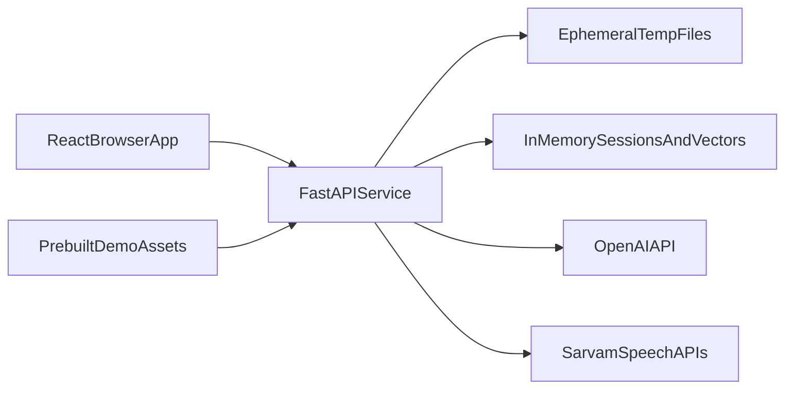
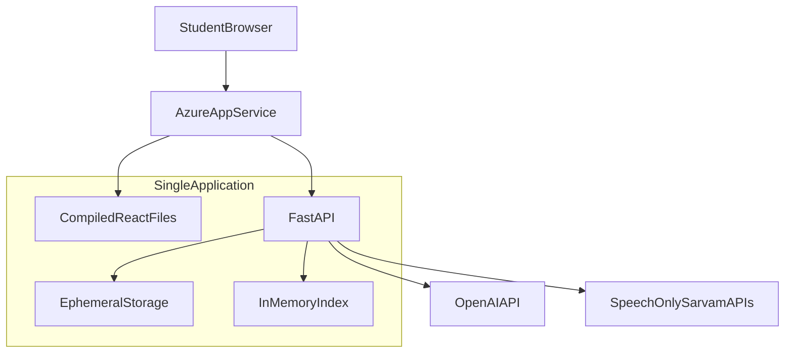
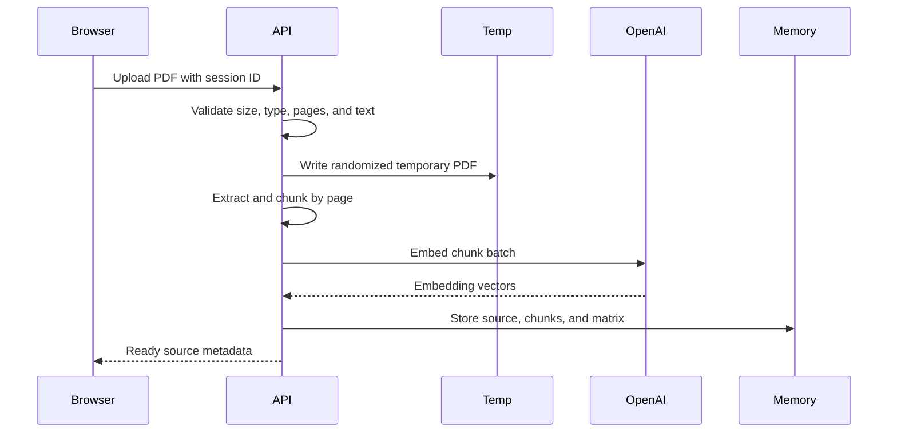

# System Architecture

## 1. Goal and scope

This is a single-instance hackathon demo, not a public multi-tenant service.
The architecture optimizes for fast implementation, a reliable presentation,
and page-cited answers.

It supports:

- One polished, pre-indexed demo source that works immediately.
- Optional temporary PDF uploads during a browser session.
- Page-aware retrieval and citation.
- Grounded chat, summaries, flashcards, quizzes, and Teach-Back.
- Optional grounded voice learning and cited Audio Overviews.
- A NotebookLM-style Sources–Chat–Studio interface.

It deliberately does not provide durable accounts, cloud file storage, a
database, background workers, or cross-device persistence.

## 2. Single-service system

### Browser

React, Vite, TypeScript, Tailwind CSS, and shadcn/ui provide the interface.
Browser `sessionStorage` keeps the current session ID, chat display state,
selected sources, and temporary activity results.

The browser captures push-to-talk audio only after explicit permission and
sends bounded recordings to FastAPI. It never receives provider credentials
and does not call Sarvam directly.

Client routes:

- `/` serves the static landing page and makes no OpenAI request.
- `/workspace` initializes or restores a temporary study session.
- FastAPI returns the SPA entry point for direct navigation to either route.

### FastAPI

One Python service:

- Serves the compiled React application.
- Accepts bounded PDF uploads.
- Extracts pages with PyMuPDF.
- Creates page-bounded chunks and OpenAI embeddings.
- Keeps temporary source metadata, chunks, and vectors in memory.
- Performs cosine similarity with NumPy.
- Calls the OpenAI Responses API.
- Calls Sarvam Saaras v3 for English-India transcription and Bulbul v3 for
  narration; Sarvam is not used for retrieval, reasoning, or content
  generation.
- Validates citations and structured artifacts.
- Derives session learning memory from quiz and Teach-Back attempts.
- Stores bounded temporary recordings, generated narration, and overview
  transcripts inside the owning session.
- Serves temporary and bundled PDFs to the evidence viewer.

### Demo assets

The repository includes a legally reusable demo PDF and precomputed derived
assets:

- Page metadata and chunks.
- Embeddings.
- Suggested prompts.
- Optional cached artifact fixtures for emergency fallback.
- An optional cached Audio Overview transcript and audio file, but only when
  redistribution rights cover both.

Do not commit copyrighted textbooks without redistribution permission.

## 3. Deployment

Deploy one application to Azure App Service:

Use one instance only. Multiple instances would hold different in-memory
sessions and require shared persistence, which is intentionally out of scope.

Azure's free tier may sleep or have limited resources. Warm the application
before judging; use student credits for a small paid tier if available.

## 4. Session lifecycle

1. On first load, the browser requests a random opaque session ID.
2. The API creates a bounded in-memory session with an expiry time.
3. The bundled demo source is attached immediately.
4. Optional uploaded PDFs are written to a randomized temporary directory.
5. Extracted chunks and embedding matrices live in that session's memory.
6. Each request refreshes the expiry time.
7. Quiz and Teach-Back attempts update a derived, session-scoped learning
   memory used by Chat and Studio.
8. Explicit reset, TTL expiry, or process restart removes temporary data.
9. Recorded audio, generated narration, transcripts, and overview artifacts
   follow the same session ownership and cleanup lifecycle.
10. Visual Deck requests and their cached-demo artifact records follow the
    same session lifecycle; the bundled fallback PDF is served only after the
    artifact is resolved inside the owning session.

Target TTL: 60 minutes. The UI clearly says temporary uploads may disappear on
refresh after expiry or when the demo server restarts.

No personal data or login is required.

## 5. Upload and ingestion flow

The first implementation may process the upload in one request. The UI shows
uploading, extracting, embedding, ready, and failed stages based on streamed
events or coarse progress updates.

## 6. Grounded answer flow

1. Validate the session and selected temporary source IDs.
2. Embed the question.
3. Compute cosine similarity against only those sources with NumPy.
4. Select diverse chunks within a context budget.
5. Label chunks with opaque IDs and trusted page metadata.
6. Ask OpenAI to answer only from those chunks.
7. Validate every returned chunk ID against the supplied retrieval set.
8. Map valid IDs to source, page, and excerpt.
9. Return the answer; retain only temporary session history.

The model never supplies trusted page numbers. Page numbers always come from
the extracted chunk metadata.

## 7. Trust and safety boundaries

- The browser and uploaded PDFs are untrusted.
- Session IDs are high-entropy capabilities, not user accounts.
- File extension and browser MIME type are not sufficient validation.
- Filenames are display metadata and never filesystem paths.
- Uploaded text is delimited as untrusted evidence, not instructions.
- OpenAI keys remain server-side.
- Sarvam keys remain server-side.
- Model output is schema- and citation-validated.
- Upload count, file size, page count, extracted characters, session memory,
  request rate, OpenAI usage, recording duration/bytes, narrated characters,
  generated audio bytes, and speech requests are bounded.

## 7.1 Grounded voice flows

Push-to-talk is request/response, not an open microphone:

1. The browser records only while the student holds or explicitly activates the
   control, stops at the configured duration cap, and uploads a supported audio
   blob to FastAPI.
2. The browser stops capture at 30 seconds. FastAPI independently validates
   session ownership, media type, and request bytes, then sends it to Sarvam
   Saaras v3 with `en-IN`.
3. The returned transcript is temporary and editable in the existing text
   composer; transcription never submits Chat or Teach-Back automatically.

Narration accepts only a server-owned assistant message or validated
Teach-Back feedback ID. FastAPI resolves the owned text, enforces character and
audio limits, and sends it to Sarvam Bulbul v3. The browser cannot supply
arbitrary narration text.

Audio Overview generation first performs selected-source retrieval through the
existing OpenAI pipeline. OpenAI returns a structured single-narrator script
with chunk IDs; the backend validates and maps all citations before Bulbul v3
narrates the final 3–5 minute transcript. The transcript and normalized
citations remain available if TTS fails.

This design is suitable for a controlled hackathon demo, not a public launch.

## 8. Failure behavior

- Restart or expiry: temporary work disappears; the bundled demo remains.
- Extraction failure: distinguish encrypted, corrupt, and image-only PDFs.
- Embedding failure: remove partial temporary data and allow retry.
- Weak retrieval: abstain instead of inventing an answer.
- Invalid structured output: retry once, then return a recoverable error.
- OpenAI billing/quota failure: offer cached demo artifacts and explain that
  live generation is unavailable.
- Microphone denial or capture failure: retain the text input path.
- Sarvam STT failure: retain the recording only within its short cleanup window
  and allow retry or manual typing.
- Sarvam TTS failure: keep the owned text, overview transcript, and citations
  readable; narration remains optional.

## 9. Observability

Log only:

- Request/session hash.
- Processing stage and duration.
- Page and chunk counts.
- Model, token usage, and estimated cost.
- Speech provider/model, audio duration/bytes, character count, latency, and
  failure category.
- Retrieval scores, selected chunk IDs, and validation outcome.

Do not log source text, transcripts, recordings, generated audio, student
answers, session tokens, temporary paths, or API keys.

## 10. Upgrade path

Add durable storage only if the product later needs accounts, cross-device
history, multiple replicas, public availability, or long-lived uploaded source
collections. At that point, replace in-memory stores behind the same interfaces
with object storage and a vector database.
